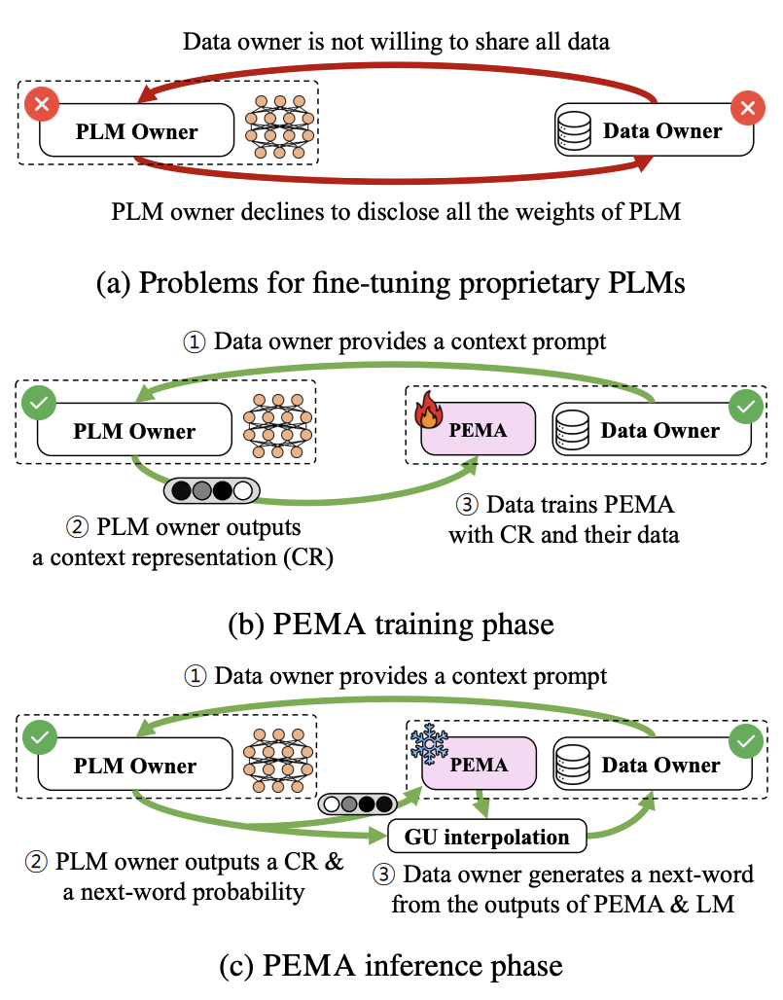
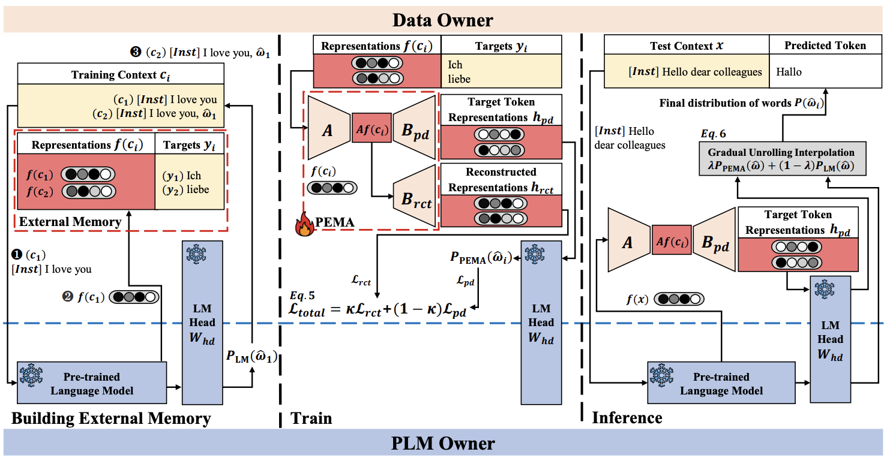

# PEMA: An Offsite-Tunable Plug-in External Memory Adaptation for Language Models [[paper](https://arxiv.org/abs/2311.08590)]

<p align="center">

</p>
<p align="center">
Figure 1. Motivation for PEMA. (a) Data owners wishing to fine-tune PLMs face a challenge when the PLM owner refuses to share all model weights. (b) In the PEMA training phase, the data owner receives a context response (CR) from the PLM owner by providing a context prompt, subsequently training their PEMA model with their dataset. (c) At inference, the data owner receives a CR for test data from the PLM owner. Using Gradual Unrolling (GU), they generate the next token by interpolating between PEMA and PLM next-token probabilities.
</p>

This repository contains the official implementation of the paper "PEMA: An Offsite-Tunable Plug-in External Memory Adaptation for Language Models", accepted at the 2024 Annual Conference of the North American Chapter of the Association for Computational Linguistics ([NAACL 2024](https://2024.naacl.org/)).

## Requirements
- Hardware: Three RTX 8000 GPUs with 48GB GDDR6 memory.
- Software: For OPT-IML-MAX1.3B, use full precision (FP32) for training and inference. For LLaMA-7B and OPT-IML-MAX30B, use half-precision (FP16) and distribute the model across three GPUs using the HuggingFace Accelerate library.

## Installation

1. **Install Anaconda**
   ```sh
   # Download Anaconda distribution for Ubuntu
   wget https://repo.anaconda.com/archive/Anaconda3-2023.07-2-Linux-x86_64.sh

   # Install Anaconda
   sh Anaconda3-2023.07-2-Linux-x86_64.sh
   ```

2. **Create and Activate Environment**
   ```sh
   # Create a new conda environment
   conda create --name pema_opt

   # Activate the environment
   conda activate pema_opt
   ```

3. **Install Required Libraries**
   ```sh
   # Update environment with required libraries
   conda env update --name pema_opt --file environment_pema_opt.yml 

   # Install HuggingFace Transformers
   cd transformers
   pip install -e .
   cd ..

   # Install HuggingFace Accelerate
   cd accelerate
   pip install -e .
   cd ..
   ```

## Download Full Dataset (Optional)
- Due to budget constraints, a subset of the WMT22 dataset is used for demonstration. Full datasets can be accessed as follows:
   ```sh
   # GYAFC corpus access requires an email request. For details, refer to:
   https://github.com/raosudha89/GYAFC-corpus

   # Download WMT22 de-en dataset:
   https://data.statmt.org/news-commentary/v16/training/

   # WMT22 test set can be found here:
   https://github.com/microsoft/gpt-MT

   # Transform downloaded parallel corpus into a single .json format:
   python parallel_corpus_to_json.py --path [path to dataset] --en_path [path to English corpus] --du_path [path to German corpus]
   ```

## Architecture
<p align="center">

</p>
<p align="center">
Figure 2. PEMA Architecture. The areas of the PLM owner and the data owner are separated by the blue horizontal line. The data owner can train and infer using only the PLM's LM head. PEMA builds an external memory from the training context with an instruction $[Inst]$ given to a PLM. The PLM outputs the representation $f(c_i)$ and predicts the next-token distribution $P_{LM}(\hat{w}_i)$. The representation $f(c_i)$ is then aligned with its target $y_i$. During training, PEMA uses external memory for two tasks: preserving the original representation via reconstruction training with $B_{rct}$ and generating a target token probability distribution using $B_{pd}$. For inference, the model inputs a test data representation to generate two probability distributions: $P_{LM}(\hat{w}_i)$ and $P_{PEMA}(\hat{w}_i)$. These are interpolated using Gradual Unrolling to obtain the final token distribution.
</p>

## Building External Memory
To build external memory, determine the required number of context representations using the following script:
```sh
# Estimate total length (e.g., 609,262)
python external_memory_builder/datastore_length.py
```

Once the length is retrieved, save the external memory:
```sh
python external_memory_builder/datastore_save.py \
    --em_size 609262 \
    --data_path wmt22/news_commentary_16_en_de_train_0.json \
    --model facebook/opt-iml-max-1.3b \
    --decoder_embed_dim 2048
```
Parameters:
- `em_size`: Length of context representation.
- `data_path`: Path to the dataset.
- `model`: OPT model variant.
- `decoder_embed_dim`: Context representation size (hidden dimension of the model).

## Training PEMA
Before training PEMA, retrieve the last `lm_head` and `layer_norm` weights:
```sh
python external_memory_builder/save_lm_head_layer_norm.py
```
Weights will be saved in the `./opt_last_layer` folder.

To train PEMA, run the following script:
```sh
# Train Reconstruction Decoder (RCT)
CUDA_VISIBLE_DEVICES=0 python train_rct_pd.py \
    --method 1 \
    --train_key_path "./dstore_keys.npy" \
    --train_val_path "./dstore_vals.npy" \
    --valid_key_path "./dstore_dev_keys.npy" \
    --valid_val_path "./dstore_dev_vals.npy" \
    --tensorboard_path "./runs/wmt22_rct_1_3b" \
    --train_dstore_size 609011 \
    --valid_dstore_size 202549 \
    --dstore_dim 2048 \
    --vocab_size 50272 \
    --save_path "./rct" \
    --num_rank 512 \
    --num_epochs 200 \
    --kappa 0.2 \
    --batch_size 20480
```

```sh
# Train Joint Retraining (RCT_PD)
CUDA_VISIBLE_DEVICES=0 python train_rct_pd.py \
    --method 3 \
    --train_key_path "./dstore_keys.npy" \
    --train_val_path "./dstore_vals.npy" \
    --valid_key_path "./dstore_dev_keys.npy" \
    --valid_val_path "./dstore_dev_vals.npy" \
    --tensorboard_path "./runs/wmt_rct_cls_1_3b_0" \
    --train_dstore_size 609011 \
    --valid_dstore_size 202549 \
    --dstore_dim 2048 \
    --vocab_size 50272 \
    --save_path "./rct_pd" \
    --num_rank 512 \
    --num_epochs 200 \
    --kappa 0.2 \
    --batch_size 2048 \
    --rct_path [trained_pema_rct_path]
```
Parameters:
- `method`: 1 for training reconstruction, 3 for joint retraining.
- `train_key_path`, `train_val_path`, `valid_key_path`, `valid_val_path`: Paths to external memory files (.npy).
- `train_dstore_size`, `valid_dstore_size`: Sizes of external memory for training and validation.
- `dstore_dim`: Context representation dimension.
- `num_rank`: Rank size.
- `kappa`: Kappa value.
- `rct_path`: Path of pre-trained RCT.

## Inference
To perform inference using a pretrained RCT_PD (i.e., PEMA):
```sh
# 90-0 Gradual Unrolling Interpolation
CUDA_VISIBLE_DEVICES=0 python ema_generate.py \
    --batch_size 30 \
    --model facebook/opt-iml-max-1.3b \
    --data_path wmt22/test.json \
    --output_dir ./pema_90_0 \
    --head_path ./opt_last_layer/opt_iml_max_1_3b_lm_head.pt \
    --lm_norm_path ./opt_last_layer/opt_iml_max_1_3b_layer_norm.pt \
    --interpolation_bool \
    --decoder_embed_dim 2048 \
    --lmbda 0.9 \
    --lora_decoder \
    --gradual_unrolling \
    --gradual_unrolling_min 0 \
    --num_rank 512 \
    --lora_linear_path wmt22_confirmed/rct_cls_0.2_lambda_5.311_loss.pt \
    --lora_trained
```

The core interpolation script can be found in transformer library folder where it has been modified in decoding process.
```
PEMA/transformers/src/transformers/generation/utils.py
```

## Post-processing
To remove common hallucinations in generated sentences, please use the following script. However, there can be addtional process needed to be further processed for optimal output:
```sh
python postprocess_generated_opt.py \
    --input ./pema_90_0/lm_pred.txt \
    --output ./pema_90_0/lm_pred_post.txt
```

## Citation
```
@inproceedings{kim-etal-2024-pema,
    title = "{PEMA}: An Offsite-Tunable Plug-in External Memory Adaptation for Language Models",
    author = "Kim, HyunJin  and
      Kim, Young Jin  and
      Bak, JinYeong",
    editor = "Duh, Kevin  and
      Gomez, Helena  and
      Bethard, Steven",
    booktitle = "Proceedings of the 2024 Conference of the North American Chapter of the Association for Computational Linguistics: Human Language Technologies (Volume 1: Long Papers)",
    month = jun,
    year = "2024",
    address = "Mexico City, Mexico",
    publisher = "Association for Computational Linguistics",
    url = "https://aclanthology.org/2024.naacl-long.336",
    pages = "6045--6064",
    abstract = "Pre-trained language models (PLMs) show impressive performance in various downstream NLP tasks. However, pre-training large language models demands substantial memory and training compute. Furthermore, due to the substantial resources required, many PLM weights are confidential. Consequently, users are compelled to share their data with model owners for fine-tuning specific tasks. To overcome the limitations, we introduce Plug-in External Memory Adaptation (PEMA), a Parameter-Efficient Fine-Tuning (PEFT) method, enabling PLM fine-tuning without requiring access to all the weights. PEMA integrates with context representations from test data during inference to perform downstream tasks. It uses external memory to store PLM-generated context representations mapped with target tokens. Our method utilizes weight matrices of LoRA-like bottlenecked adapter in the PLM{'}s final layer to enhance efficiency. Our approach also includes Gradual Unrolling, a novel interpolation strategy to improve generation quality. We validate PEMA{'}s effectiveness through experiments on syntactic and real datasets for machine translation and style transfer. Our findings show that PEMA outperforms other PEFT approaches in memory and latency efficiency for training, and also excels in maintaining sentence meaning and generating appropriate language and styles.",
}
```